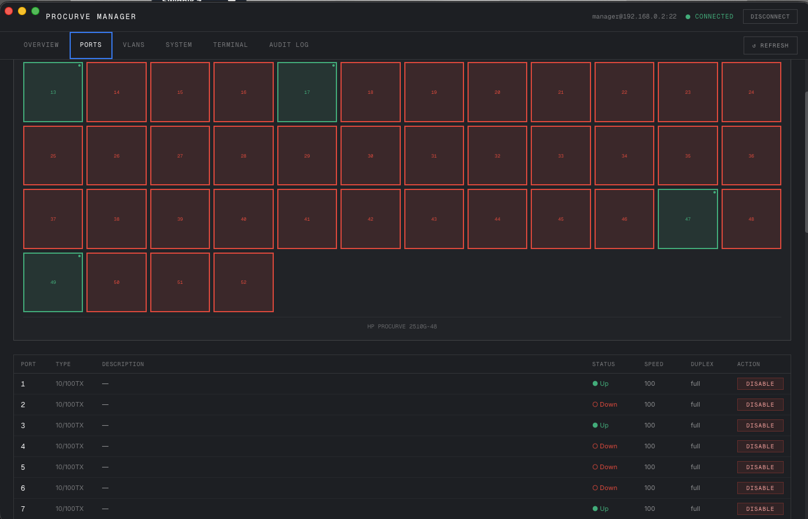
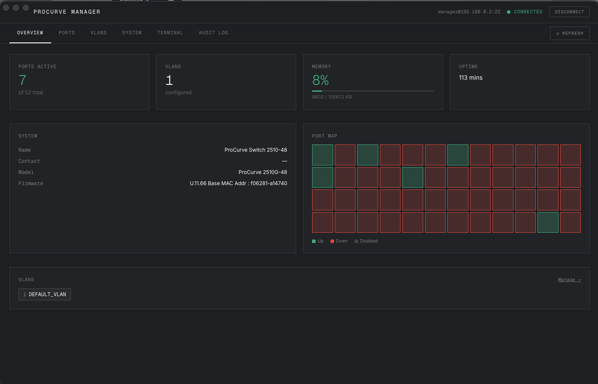
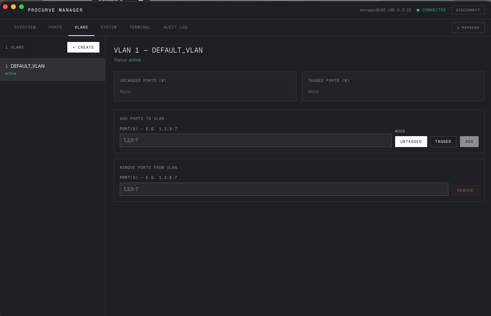
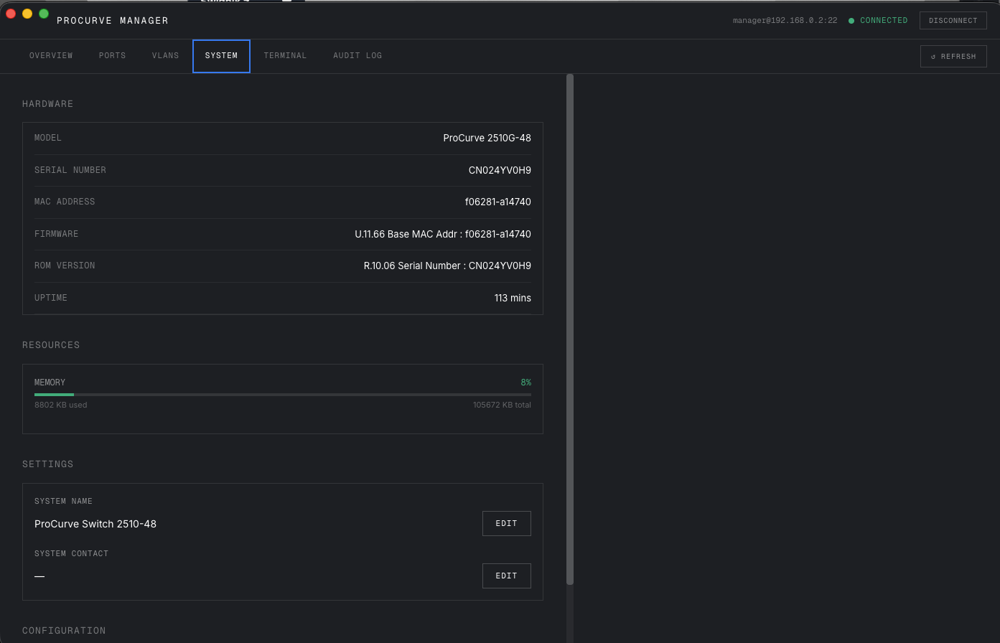
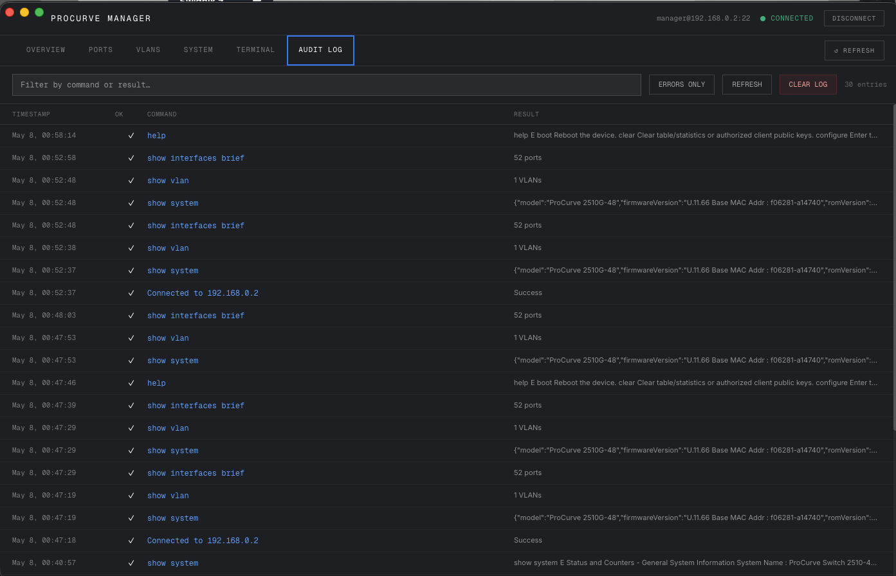
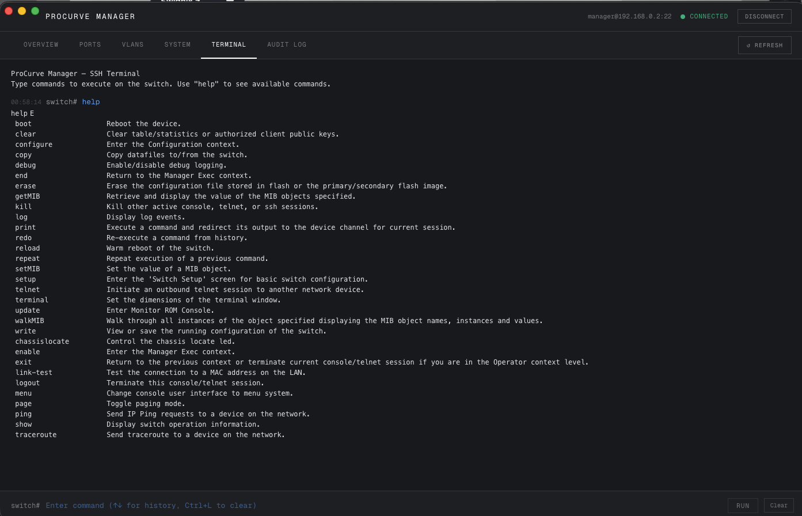

# 🛰️ ProCurve Manager

[](https://www.electronjs.org/)
[](https://reactjs.org/)
[](https://www.typescriptlang.org/)
[](https://opensource.org/licenses/MIT)

**ProCurve Manager** is a high-performance, modern desktop application designed for network engineers to manage HP ProCurve switches with ease. Built on Electron and React, it provides a powerful GUI wrapper around the SSH command-line interface, offering visual port maps, VLAN orchestration, and real-time system monitoring.

---

## 📸 Screenshots

### Dashboard & Overview


### Connectivity & Port Management
| Connection Manager | Port Configuration |
| :---: | :---: |
|  |  |

### Networking & Auditing
| VLAN Orchestration | Audit Logging |
| :---: | :---: |
|  |  |

### Embedded CLI


---

## ✨ Key Features

- **🔐 Secure Profile Management:** Securely store multiple switch profiles. Passwords are encrypted locally and never stored in plain text.
- **📊 Real-Time Analytics:** Monitor CPU load, memory utilization, and system uptime through a clean, intuitive dashboard.
- **🔌 Visual Port Map:** A 1:1 visual representation of your switch chassis. Check link status (Up/Down/Disabled) at a glance and configure speed, duplex, and flow control with two clicks.
- **🏷️ VLAN Orchestration:** Simplify complex VLAN tasks. Create, rename, and manage port memberships (tagged/untagged) without memorizing CLI syntax.
- **⌨️ Embedded Terminal:** Need the raw CLI? Use the integrated SSH terminal with command history support.
- **📑 Command Audit Log:** Every change is tracked. View a historical log of every command sent to the switch and its resulting output.
- **🎨 Custom Branding:** Professional application icon and matching "Geist Mono" aesthetic.

---

## 🚀 Getting Started

### Prerequisites

- [Node.js](https://nodejs.org/) (v18 or higher)
- [npm](https://www.npmjs.com/) or [Bun](https://bun.sh/)
- Access to an HP ProCurve switch via SSH

### Installation

1. **Clone the repository**
   ```bash
   git clone https://github.com/syrex1013/ProCurveUI.git
   cd ProCurveUI
   ```

2. **Install dependencies**
   ```bash
   npm install
   ```

3. **Launch in development mode**
   ```bash
   npm run dev
   ```

4. **Build for your platform**

   Follow the commands below to generate a production executable for your operating system. The built files will be located in the `dist/` directory.

   ```bash
   # Build for macOS (.dmg, .zip)
   npm run package:mac
   
   # Build for Windows (.exe, portable)
   npm run package:win

   # Build for Linux (.AppImage, .deb)
   npm run package:linux
   ```

   *Note: It is recommended to build on the target operating system to ensure native dependencies are compiled correctly.*

---

## 🛠️ Technical Architecture

- **Core:** Electron (Main Process) + React (Renderer)
- **Networking:** `ssh2` for low-latency command execution.
- **Database:** `better-sqlite3` for local persistence.
- **Styling:** Vanilla CSS with custom "Geist Mono" typography for a terminal-inspired aesthetic.
- **Parsing:** Custom regex-based parsers for ProCurve CLI outputs.

---

## 🤝 Contributing

Contributions are welcome! Please feel free to submit a Pull Request.

1. Fork the Project
2. Create your Feature Branch (`git checkout -b feature/AmazingFeature`)
3. Commit your Changes (`git commit -m 'Add some AmazingFeature'`)
4. Push to the Branch (`git push origin feature/AmazingFeature`)
5. Open a Pull Request

---

## 📜 License

Distributed under the MIT License. See `LICENSE` for more information.

---

*Developed with ❤️ for the networking community.*
